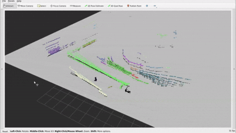

# dynamic-box
3D point cloud segmentation algorithm for consecutive LiDAR scans using kd-tree-based euclidean cluster extraction. These obstacle clusters can be converted to birds-eye view for visualization, 3D-oriented bounding boxes for capturing obstacle poses, occupancy grids for planning, etc.



## Euclidean Cluster Extraction ROS2 Package:
It is recommended that the ROS2-integrated Euclidean Cluster Extraction algorithm be run in the provided Docker container, which has already packaged all required code and dependencies. 

### ROS2 Package Architecture:
```
ROS2 distro=Humble
package_name=my_rosbag_reader
```

UniTree LiDAR scans have message type: ```PointCloud2``` and publish to the ```unilidar/cloud``` topic.

```my_rosbag_reader/my_rosbag_reader/live.py``` is a Subscriber node subscribed to the ```unilidar/cloud``` topic.

When LiDAR scan data is published, ```my_rosbag_reader/my_rosbag_reader/live.py```'s callback function, ```listener_callback```, will run the Euclidean Cluster Extraction algorithm and return an array containing cluster partitions of the point cloud. 

Point clouds partitioned into their respective clusters are published as a ```PointCloud2``` array to the ```/rslidar_obstacles``` message.

## Euclidean Cluster Extraction Implementation (Not Updated, Look At Recent Updates):
### Recent Updates:
|  Date     | Changelog / Update Notes |
|:----------|:-----------|
| 9/18/25   | - Added custom single obstacle ```Obstacle.msg``` and obstacle arrays ```Obstacles.msg``` messages to [cev_msgs](https://github.com/cornellev/cev_msgs). <br> - Now publishes ```Obstacle(s)``` to ```/rslidar_obstacles``` message. |
| 9/14/25   | - Clusters with seed starting points are grown in parallel, where each ```cluster_cpp.euclidean_cluster``` call is limited to only one cluster grown. <br> - New obstacles and outlier points that are not captured in past centroid seeds are still grown sequentially from one random seed, no constraints on ```MAX_CLUSTER_NUM```. <br> - Clustering on the very first LiDAR scan is used to initialize the first set of seeds and is not parallelized. |
| 9/13/25   | - Seeds act as starting points for cluster growing. For the centroid of past cluster, the closest point in the current scan to such centroid is initialized as a new seed. <br> - ```cluster_cpp.euclidean_cluster``` now takes in arguments ```seeds : Eigen::Vector4d``` and ```MAX_CLUSTER_NUM``` that represent fixed starting points and maximum number of clusters allowed to be grown, respectively. |
| 9/12/25   | - ```cluster.cpp``` contains C++ implementations of Euclidean Cluster Extraction function ```euclidean_cluster``` and the ```Node``` class, which contains ```make_kdtree, search_point``` and ```search_tree``` functions. <br> - To speedup clustering, the C++ implementation of Euclidean Cluster Extraction ```cluster_cpp.euclidean_cluster``` is now used in place of the Python version. |

### Euclidean Cluster Extraction Algorithm 

For each scan published, we first initialize the set of unexplored points ```Node.unexplored``` as being all 3D points in such input LiDAR scan ```cloud```. 

To optimize nearest neighbor search, a KD-Tree representation of ```cloud``` is used as input into the ```euclidean_cluster``` function, which implements Euclidean Cluster Extraction.

Euclidean Cluster Extraction follows these general steps:
1) We initially have an empty array of clusters ```C```. 
2) For cluster growing with seeds, seed $(x, y, z)$ is used as the starting point for growing a new cluster.

   Otherwise, we pop some arbitrary point $(x, y, z)$ from ```Node.unexplored``` that will be used as the first element in a stack of seeds ```stack``` for growing a new cluster ```c``` $\in$ ```C```.
3) Starting from $(x, y, z)$ and leveraging the KD-Tree representation, we recursively search for neighbors in ```Node.unexplored``` around $(x, y, z)$ and add them ```stack```. 
Nearest points of $(x, y, z)$ are found by traversing the KD-Tree until the leaf containing $(x, y, z)$ and its neighbors is reached. Then for arbitrary neighbor $(x', y', z')$, let us define the "neighbor" condition: $$ \bold{if} \text{ } \ell^2 \text{-distance between } (x, y, z) \text{ and } (x', y', z') < radius \text{, } \bold{then} \text{ add } (x', y', z') \text{ to } stack.$$
If the previous condition is satisfied, also add $(x', y', z')$ to cluster ```c```.
4) The recursion terminates when there are no more unexplored points that satisfy the "neighbor" condition, signalling that ```c``` has finished growing.
5) If there exists another point from ```Node.unexplored```, repeat steps 2 to 5 to recursively grow new clusters until all points from ```cloud``` belong to some cluster in ```C```. 
6) Before outliers are filtered out, Euclidean Cluster Extraction should return a partition of clusters {```c_1, ..., c_i```} s.t. $i \in$ [1, len(```cloud```)] and ```c_1``` $\cup$ ... $\cup$ ... ```c_i``` = ```C```.
7) To filter out clusters formed by sparse, outlier points with very few to no neighbors, keep only clusters ```c'``` in ```C``` where the number of points in ```c'``` are greater than hyperparameter ```MIN_CLUSTER_SIZE```. Where default ```MIN_CLUSTER_SIZE``` = 1.

NOTE: One critical assumption made for Euclidean Cluster Extraction is that input point clouds are relatively dense such that the maximum distance ```radius``` between two "adjacent" points in the same cluster is less than the minimum distance between two points belonging to different clusters. When this assumption does not hold, we can observe the algorithm merging clusters representing different objects together. 

For the task of object tracking over different frames, we want to be able to observe some consistency in the shapes and numbers of clusters across consecutve LiDAR scans. Given consecutive LiDAR scans, we cannot assume that the number of clusters returned by Euclidean Cluster Extraction remains constant, as it is common for objects to enter and exist the LiDAR's range. 

However, suppose we made the assumption that the time passed between two consecutive scans (```A, B```) is negligibly small enough that given:
- some object ```O```,
- cluster ```c_A``` corresponding to object ```O``` in scan ```A```,
- cluster ```c_B``` corresponding to object ```O``` in scan ```B```, 

there exists some spatial overlap between ```c_A``` and ```c_B``` s.t. for any other arbitary cluster ```c_B'``` in scan ```B```, the number of points in ```c_B``` that lie in ```c_A```'s boundary should be greater than the number of points in ```c_B'``` that lie in ```c_A```'s boundary. 

We could also claim that the $\ell^2$-distance between ```c_A``` and ```c_B```'s centroids are less than the $\ell^2$-distance between ```c_A``` and ```c_B'```.

Then, if we made the assumption that negligibly small amounts of time passed between two consecutive LiDAR scans, we could use the mentioned conditions to match previous and current clusters that correspond to the same object.

### On Parallelizing Euclidean Cluster Extraction

In order to parallelize the segmentation algorithm, Euclidean Cluster Extraction is split into sequential and parallel versions:

The initial LiDAR scan is ran on sequential Euclidean Cluster Extraction, where no assumptions of the structure of the point cloud is made, and $n$ clusters are allowed to be grown from some random starting point, which we call a seed.

For the $i^{th}$ LiDAR scan, parallel Euclidean Cluster Extraction takes the $n$ centroids of the clusters grown from the $(i-1)^{st}$ LiDAR scan. $n'$ seeds, where $n' \leq n$, are intialized as being the closest points in the $i^{th}$ scan to the $n$ past centroids. 
This is made under the assumption that translation between two consecutive LiDAR scans is negligibly small.

Then, $n'$ clusters are grown in parallel from these $n'$ seeds. Specifically, Euclidean Cluster Extraction with ```MAX_CLUSTER_NUMS = 1``` is run on each seed. We do not assume that the number of clusters in consecutive scans is constant, as objects moving in and out of the LiDAR's range will vary. As such, for remaining points in the $i^{th}$ LiDAR scan that have not been clustered, sequential Euclidean Cluster Extraction is ran on this subset of points.

In terms of speedup and optimization, the runtime of segmentation on fully parallelized Euclidean Cluster Extraction is constrained by the largest cluster, or the cluster with the most points. If there are no overlaps between two consecutive LiDAR scans, then only  sequential Euclidean Cluster Extraction will grow clusters.

## Installation:
### [Required] Building and Running the Provided Docker Image:
All Python and ROS2 dependencies in ```my_rosbag_reader``` will be automatically installed and built with the provided Docker image:
```
git clone --branch improvements git@github.com:cornellev/dynamic-box.git --single-branch
docker build -t dbimage .
docker run -it --name dbimage dbimage bash
```

After building the docker image ```dbimage```, directories should appear in a layout similar to:
```
/home/dev/ws/src/
├── ./
├── ../
├── cev_msgs/
├── dynamic-box/
│   ├── baggies/
│   │   └── rosbag2_2022-04_14-ped_vehicle/
│   │       └── rosbag2_2022_04_14-16_52_40_0.db3
│   └── my_rosbag_reader/ 
│       ├── cluster_node/
│       │   ├── CMakeLists.txt
│       │   ├── msg/
│       │   ├── package.xml
│       │   └── src/cluster_node.cpp
│       ├── package.xml  
│       ├── my_rosbag_reader/
│       ├── resource/ 
│       ├── setup.cfg
│       └── setup.py  
├── Obstacle_node/
├── rslidar_msg/
└── rslidar_sdk/
```
The following are different ways to run the clustering and matching demo.

### Option 1: Run from Makefile
There is a ```Makefile``` that will launch all necessary ROS2 nodes for the clustering and matching demo, in ```/home/dev/ws/src``` run:
```
make
```

### Option 2: Run Manually
Running the docker image will automatically build, but not source ```rslidar_msg, rslidar_sdk, cev_msgs```, and ```my_rosbag_reader``` ROS2 packages.
Source these packages by going to ```/home/dev/ws/src``` and running:
```
source install/setup.bash
cd /dynamic-box/my_rosbag_reader
source install/setup.bash
```

To open the RVis2 visualizer, run 
```
ros2 launch rslidar_sdk start.py
``` 

Open a new terminal, to start publishing the demo LiDAR scan to ```/rslidar_points```, go to directory ```/home/dev/ws/src/dynamic-box/baggies/rosbag2_2022_04_14-ped_vehicle/``` and run:
```
ros2 bag play rosbag2_2022_04_14-16_52_40_0.db3 --loop
```

Then, in a separate terminal, after sourcing ```cev_msgs``` and ```my_rosbag_reader``` and going to directory ```/home/dev/ws/src/dynamic-box/my_rosbag_reader/cluster_node/```, run
```
colcon build --packages-select cluster_node cluster_cpp
source install/setup.bash
ros2 run cluster_cpp cluster_node
```
which will begin outputting ```PointCloud2``` clusters to the ```\rslidar_obstacles``` topic!

In a fourth terminal, go to directory ```/home/dev/ws/src/Obstacle_node/``` and run:
```
colcon build --packages-select obstacle 
```

### Getting Online LiDAR Inputs via Ethernet
Check that your device is recieving data from the LiDAR by running ```ping 192.168.1.100```. 

You should be seeing continuous outputs of the format:

```
... bytes from 192.168.1.100: icmp_seq=... ttl=... time=... ms
```

If there are no outputs in pinging, check and link ethernet connection via:

```
sudo ip link set enp4s0 up
sudo ip addr ad 192.168.1.100/24 dev enp4s0
```

OR

```
sudo ip link set enP8p1s0 up
sudo ip addr ad 192.168.1.100/24 dev enP8p1s0
```

Pray and hope that ```ping 192.168.1.100``` outputs something.


## Euclidean Cluster Extraction Important links:
[Fast Euclidean Cluster Extraction Using GPUs](https://www.jstage.jst.go.jp/article/jrobomech/32/3/32_548/_pdf)